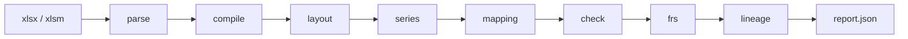

# cashflow-audit

[](LICENSE)
[](https://www.python.org/downloads/)
[](https://docs.astral.sh/uv/)

Сервис **проверяет** готовую Excel-модель CashFlow и пишет JSON-отчёт: ячейка, в чём расхождение, на что влияет, что посмотреть. **Файл модели не меняется.**

Проверки делает код (формулы, периоды, сходимость баланса и кассы). Языковая модель не разбирает Excel и не ищет ошибки: только подпись неоднозначных строк и текст карточки.

Полное описание простым языком: **[Как работает сервис](docs/guide.md)**.



## Быстрый старт

Нужны Python 3.12+ и [uv](https://docs.astral.sh/uv/). Redis для CLI не нужен.

```bash
uv sync
cp .env.example .env          # по желанию: URL моделей; ключ не обязателен
uv run cashflow-audit audit ./model.xlsx -o ./report.json
```

Повтор того же файла тем же человеком пропускает готовые стадии и не вызывает LLM, если уже есть `mapping.json` или `report.json`.

## Что на входе и на выходе

| Вход | Как |
|---|---|
| Книга | `.xlsx` / `.xlsm` (не `.xls` / `.xlsb`, не пароль) |
| Кто вы | HTTP: заголовок `X-Actor-Id`. CLI: `anonymous` |
| Модели | Необязательно. Нет LLM — отчёт шаблонный |

Снаружи: **статус задания** и контент по шагам — `GET /report` (матрица FRS), `/integrity`, `/layout`, `/mapping`. Промежуточные parquet по HTTP не отдаём. Рекомендация в карточке не предлагает править книгу.

`audit_id` = sha256(кто вы + «:» + sha256 файла). Разные люди с одним файлом — разные аудиты.

Статусы: `queued` → `running` → `succeeded` / `needs_input` / `degraded` / `failed`. Если находок не было, живой LLM не делает отчёт `degraded`.

## CLI

```bash
uv run cashflow-audit audit ./model.xlsx -o ./report.json --data-dir ./data
uv run cashflow-audit ping   # Redis (если задан) и порты моделей
```

Артефакты: `data/audits/{audit_id}/`. Логи — JSON в stdout (`LOG_JSON`, `LOG_LEVEL`).

## HTTP

Нужен Redis. Без `X-Actor-Id` — `400 missing_actor`.

```bash
uv run cashflow-audit serve --host 127.0.0.1 --port 8080
```

```http
POST /v1/audits                    # multipart, поле file
GET  /v1/audits/{id}               # опрос; Retry-After: 2 пока queued/running
GET  /v1/audits/{id}/report
POST /v1/audits/{id}/answers       # ответы на questions, затем снова очередь
GET  /healthz
GET  /readyz
```

Тела и коды: [`docs/architecture/api.md`](docs/architecture/api.md).

Проверка маршрутов (`curl` + `python3`), сервис уже слушает порт:

```bash
# терминал 1
.venv/bin/cashflow-audit serve --host 127.0.0.1 --port 8080

# терминал 2
bash scripts/probe/run.sh
```

Подробности: [`scripts/probe/README.md`](scripts/probe/README.md).

## Docker

В образе нет весов моделей. Redis — sidecar, LLM и embeddings — с хоста.

Порты моделей — OpenAI-compatible JSON. URL = `{BASE_URL}` + путь (`/chat/completions`, `/embeddings`, `/models`). Суффиксы chat/embed можно сменить: `LLM_CHAT_PATH`, `EMBEDDING_PATH`. В `.env` для compose:

```bash
LLM_BASE_URL=http://host.docker.internal:1234/v1
LLM_MODEL=google/gemma-4-e2b
EMBEDDING_BASE_URL=http://host.docker.internal:1234/v1
EMBEDDING_MODEL=text-embedding-qwen3-embedding-0.6b
```

В контейнере `127.0.0.1`/`localhost` переписываются в `host.docker.internal`. Ключ можно оставить пустым.

Свой HTTPS CA: `LLM_TLS_CA_FILE` и `EMBEDDING_TLS_CA_FILE` — пути к PEM **внутри контейнера**. Пример volume: `- /etc/ssl/llm-ca.pem:/certs/llm.pem:ro` и `LLM_TLS_CA_FILE=/certs/llm.pem`.

```bash
cp .env.example .env
docker compose up --build
```

В сети compose `REDIS_URL=redis://redis:6379/0`. Данные аудитов — том `/data`.

## Конфигурация

Скопируйте [`.env.example`](.env.example) в `.env`. Читает [`src/cashflow_audit/settings.py`](src/cashflow_audit/settings.py).

| Слой | Примеры | Где |
|---|---|---|
| Секреты и URL | `REDIS_URL`, `LLM_*`, `EMBEDDING_*` | env / `.env` |
| Процесс | `DATA_DIR`, слоты, TTL, бюджеты | Settings, дефолты в коде |
| Правила аудита | пороги, `taxonomy.yaml` | исходники, не env |

`LLM_*` и `EMBEDDING_*` независимы. Для `serve` нужен `REDIS_URL`. Без URL моделей сервис поднимается, карточки шаблонные.

## Тесты

```bash
uv run pytest
uv run ruff check src tests
```

## Документация

- **[Как работает сервис](docs/guide.md)** — для человека без контекста
- [Оглавление docs/](docs/README.md)
- [Требования](docs/требования.md)
- [Архитектура](docs/architecture/plan.md)
- [HTTP API](docs/architecture/api.md)
- [Правила разработки](AGENTS.md)

## Лицензия

[Apache License 2.0](LICENSE)
