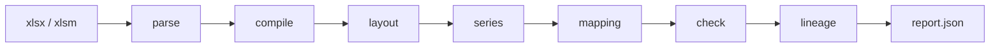
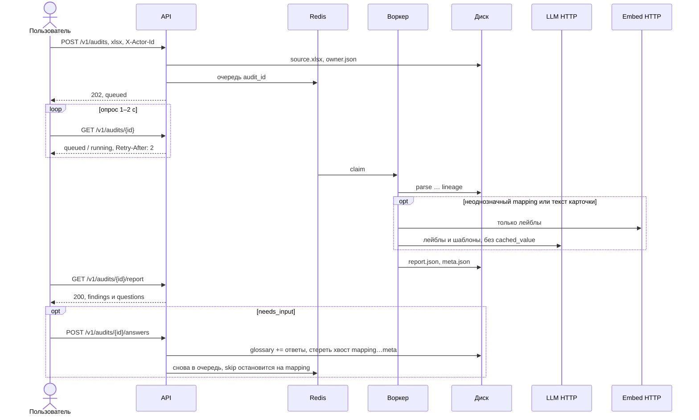

# cashflow-audit

[](LICENSE)
[](https://www.python.org/downloads/)
[](https://docs.astral.sh/uv/)

Аудит Excel-моделей CashFlow. Книга на диске не меняется.

Детектор — код. LLM не разбирает Excel и не ищет ошибки: только неоднозначный маппинг статей и текст карточки. Находка без ссылок на ячейки IR в отчёт не попадает.



## Зачем

Обычные инструменты помогают *собрать* модель. Этот сервис *проверяет* уже готовую: граф формул, оси периодов, сходимость баланса и кэша, скрытые входы, константы в формулах.

LLM и embeddings — **два разных** внешних HTTP-сервиса (OpenAI-compatible), не в поде. Если их нет, прогон всё равно заканчивается: шаблоны карточек и глоссарий HITL, статус `degraded` или `needs_input`.

## Вход

| Что | Как | Обязательно |
|---|---|---|
| Книга | `.xlsx` / `.xlsm` — путь в CLI или multipart-поле `file` | да |
| Пользователь | HTTP: заголовок `X-Actor-Id`. CLI: `anonymous` | да для HTTP |
| Ответы HITL | `POST .../answers` с `{ question_id, concept_id }` | нет, только если в отчёте есть `questions` |
| LLM и embeddings | переменные `LLM_*` и отдельно `EMBEDDING_*` | нет |

Не принимаем `.xls`, `.xlsb`, пароль, URL внешней книги, правки ячеек. Потолок тела ≈ 250 МиБ.

`audit_id` = sha256(`actor_id` + `:` + sha256 файла). Один пользователь и те же байты — тот же id. Разные пользователи с одним файлом — разные аудиты.

## Выход

Снаружи два объекта. Parquet, mapping и lineage по HTTP не отдаём.

1. **Статус задания** — `queued`, `running`, `succeeded`, `needs_input`, `degraded`, `failed`.
2. **Отчёт** `report.json` — когда файл уже на диске.

В отчёте: `findings` (ячейка, доказательство, метрики, влияние, рекомендация) и `questions`. Рекомендация не предлагает править книгу. Поле `sha256` — хеш содержимого файла, не `audit_id`.

CLI пишет отчёт в `-o`. HTTP: сначала статус, потом `GET .../report`.

## Как это работает



Повторный `POST` того же файла тем же пользователем после готового отчёта — сразу `200` и `report_url`, без очереди и без LLM.

CLI вызывает тот же `Pipeline.run` без Redis: файл → `report.json`.

## Возможности

| | |
|---|---|
| Детекторы | Ошибки Excel, маскировка `IFERROR`, циклы, смена формулы по периодам, тождества I1/I3, скрытые входы |
| Цитаты | У каждой находки ячейки IR вида `Лист!A1` |
| Идемпотентность | Тот же актор и те же байты — тот же `audit_id`; готовые стадии пропускаются |
| Изоляция | `X-Actor-Id` разделяет аудиты и глоссарии; в HTTP нет `anonymous` |
| Книга | Только чтение |

## Быстрый старт

Нужны Python 3.12+ и [uv](https://docs.astral.sh/uv/). Redis для CLI не нужен.

```bash
uv sync
cp .env.example .env          # по желанию: LLM_* и EMBEDDING_*
uv run cashflow-audit audit ./model.xlsx -o ./report.json
```

## Использование

### CLI

```bash
uv run cashflow-audit audit ./model.xlsx -o ./report.json --data-dir ./data
uv run cashflow-audit ping   # Redis (если задан), GET /models + id, POST ping
```

Актор — `anonymous`. Артефакты: `data/audits/{audit_id}/`. Повтор того же файла пропускает готовые стадии и не вызывает LLM, если уже есть `mapping.json` или `report.json`.

Логи: JSON в stdout (`LOG_JSON=true` по умолчанию в `.env.example`), уровень — `LOG_LEVEL` (`INFO`).

### HTTP

Нужен Redis. Без `X-Actor-Id` ответ `400 missing_actor`.

```bash
uv run cashflow-audit serve --host 127.0.0.1 --port 8080
```

```http
POST /v1/audits                    # multipart, поле file
GET  /v1/audits/{id}               # опрос; Retry-After: 2 пока queued/running
GET  /v1/audits/{id}/report
POST /v1/audits/{id}/answers       # HITL, затем снова очередь с mapping
GET  /healthz
GET  /readyz
```

Тела запросов и коды: [`docs/architecture/api.md`](docs/architecture/api.md).

### Docker

В образе нет весов моделей. Redis — sidecar, LLM и embeddings — с хоста через env.

```bash
cp .env.example .env
docker compose up --build
```

В сети compose `REDIS_URL` равен `redis://redis:6379/0`. Данные аудитов — том `/data`.

## Конфигурация

Скопируйте [`.env.example`](.env.example) в `.env` (файл в gitignore). Читает [`src/cashflow_audit/settings.py`](src/cashflow_audit/settings.py).

| Слой | Примеры | Где хранится |
|---|---|---|
| Секреты и URL моделей | `REDIS_URL`, `LLM_*`, `EMBEDDING_*` | env / `.env` |
| Кнопки процесса | `DATA_DIR`, слоты, TTL, бюджеты | тот же Settings, дефолты в коде |
| Правила аудита | cosine, zip, CSR, `taxonomy.yaml` | исходники, не env |

`LLM_BASE_URL` и `EMBEDDING_BASE_URL` независимы: эмбедер не подставляет URL чата.

Для `serve` нужен `REDIS_URL`. Без `LLM_*` / `EMBEDDING_*` сервис поднимается, порты просто молчат.

## Тесты

```bash
uv run pytest
uv run ruff check src tests
```

## Документация

- [Требования](docs/требования.md)
- [Архитектура](docs/architecture/plan.md)
- [HTTP API](docs/architecture/api.md)
- [Правила разработки](AGENTS.md)

## Лицензия

[Apache License 2.0](LICENSE)
