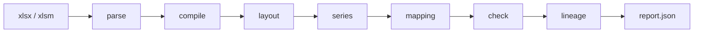

# cashflow-audit

[](LICENSE)
[](https://www.python.org/downloads/)
[](https://docs.astral.sh/uv/)

Audit Excel CashFlow workbooks. The file is never modified.

Детекторы — код. LLM не парсит книгу и не ищет ошибки: только неоднозначный маппинг статей и текст карточки. Находка без `cell_refs` из IR в отчёт не попадает.



## Why

Most spreadsheet tooling helps you *build* a model. This one *audits* a model you already have: formula graph, period axes, identity checks, hidden inputs, hardcodes.

Optional LLM and embeddings are **separate** OpenAI-compatible HTTP services (not in the pod). Without them the run still finishes (`degraded` / `needs_input`) using templates and the HITL glossary.

## Input

| Вход | Как | Обязателен |
|---|---|---|
| Книга CashFlow | `.xlsx` / `.xlsm` (CLI путь или HTTP multipart `file`) | да |
| Кто пользователь | HTTP: заголовок `X-Actor-Id`. CLI: `anonymous` | да для HTTP |
| Ответы HITL | `POST .../answers` `{ question_id, concept_id }` | нет, только если в отчёте `questions` |
| LLM / embeddings | env `LLM_*` и отдельно `EMBEDDING_*` | нет |

Не принимаем: `.xls`, `.xlsb`, пароль, URL внешней книги, правки ячеек. Потолок тела ≈ 250 МиБ.

`audit_id` = sha256(`actor_id` + `:` + sha256 файла). Один человек + те же байты → тот же id. Разные люди с одним файлом → разные аудиты.

## Output

Снаружи два объекта. Parquet, mapping, lineage по HTTP не отдаём.

1. **Статус job** — `queued` / `running` / `succeeded` / `needs_input` / `degraded` / `failed`.
2. **Отчёт** `report.json` — когда файл есть на диске.

Канон отчёта: `findings[]` (ячейка, доказательство, метрики, влияние, рекомендация; файл не меняли) и `questions[]`. Находка без `cell_refs` из IR в ответ не попадает. `sha256` в отчёте — хеш содержимого книги, не `audit_id`.

CLI пишет отчёт в `-o`. HTTP: poll статуса, затем `GET .../report`.

## Interaction

```mermaid
sequenceDiagram
  actor User
  participant API
  participant Redis
  participant Worker
  participant Disk
  participant LLM as LLM HTTP
  participant Emb as Embed HTTP

  User->>API: POST /v1/audits + xlsx + X-Actor-Id
  API->>Disk: source.xlsx, owner.json
  API->>Redis: queue audit_id
  API-->>User: 202 { audit_id, queued }

  loop poll 1–2s
    User->>API: GET /v1/audits/{id}
    API-->>User: queued / running + Retry-After: 2
  end

  Redis->>Worker: claim
  Worker->>Disk: parse … check … lineage
  opt mapping ambiguous / explain prose
    Worker->>Emb: labels only
    Worker->>LLM: templates + labels, no cached_value
  end
  Worker->>Disk: report.json + meta.json
  User->>API: GET /v1/audits/{id}/report
  API-->>User: 200 findings + questions

  opt needs_input
    User->>API: POST /v1/audits/{id}/answers
    API->>Disk: glossary += answers; drop mapping…meta
    API->>Redis: queue again (skip stops at mapping)
  end
```

Повторный POST того же файла тем же актёром после готового отчёта — сразу `200` + `report_url`, без очереди и без LLM.

CLI тот же `Pipeline.run`, без Redis: файл → `report.json`.

## Features

| | |
|---|---|
| Deterministic detectors | Excel errors, IFERROR masking, circular refs, formula drift, identity I1/I3, hidden inputs |
| Citation | Every finding cites IR cells (`Sheet!A1`) |
| Idempotent | Same actor + same bytes → same `audit_id`; skip stages if artifacts exist |
| Isolation | `X-Actor-Id` keys audits and glossary; no anonymous HTTP |
| No rewrite | Workbook is read-only |

## Quick start

```bash
uv sync
cp .env.example .env          # optional: LLM_* and EMBEDDING_*
uv run cashflow-audit audit ./model.xlsx -o ./report.json
```

Python 3.12+ and [uv](https://docs.astral.sh/uv/). Redis is **not** required for CLI.

## Usage

### CLI

```bash
uv run cashflow-audit audit ./model.xlsx -o ./report.json --data-dir ./data
```

`actor_id=anonymous`. Artifacts land in `data/audits/{audit_id}/`. A second run of the same file skips completed stages and does not call LLM if `mapping.json` / `report.json` already exist.

### HTTP

Needs Redis. Header `X-Actor-Id` is required (`400 missing_actor` if missing).

```bash
uv run cashflow-audit serve --host 127.0.0.1 --port 8080
```

```http
POST /v1/audits                    # multipart field file=
GET  /v1/audits/{id}               # poll; Retry-After: 2 while queued/running
GET  /v1/audits/{id}/report
POST /v1/audits/{id}/answers       # HITL → re-queue from mapping
GET  /healthz
GET  /readyz
```

Request/response bodies: [`docs/architecture/api.md`](docs/architecture/api.md).

### Docker

Redis sidecar only. LLM and embeddings stay on the host via env.

```bash
cp .env.example .env
docker compose up --build
```

Inside the compose network `REDIS_URL` is `redis://redis:6379/0`. Audit data is volume `/data`.

## Configuration

Copy [`.env.example`](.env.example) to `.env` (gitignored). Loaded by `Settings` in [`src/cashflow_audit/settings.py`](src/cashflow_audit/settings.py).

| Layer | Examples | Stored in |
|---|---|---|
| Secrets and model URLs | `REDIS_URL`, `LLM_*`, `EMBEDDING_*` | env / `.env` |
| Process knobs | `DATA_DIR`, slots, TTL, budgets | same Settings, code defaults |
| Audit rules | cosine, zip caps, CSR, `taxonomy.yaml` | source, not env |

`LLM_BASE_URL` and `EMBEDDING_BASE_URL` are independent. Embed never falls back to the chat URL.

`serve` requires `REDIS_URL`. Omit `LLM_*` / `EMBEDDING_*` to run without those ports.

## Tests

```bash
uv run pytest
uv run ruff check src tests
```

## Documentation

- [Requirements](docs/требования.md)
- [Architecture](docs/architecture/plan.md)
- [HTTP API](docs/architecture/api.md)
- [Agent / contributor rules](AGENTS.md)

## License

[Apache License 2.0](LICENSE)
