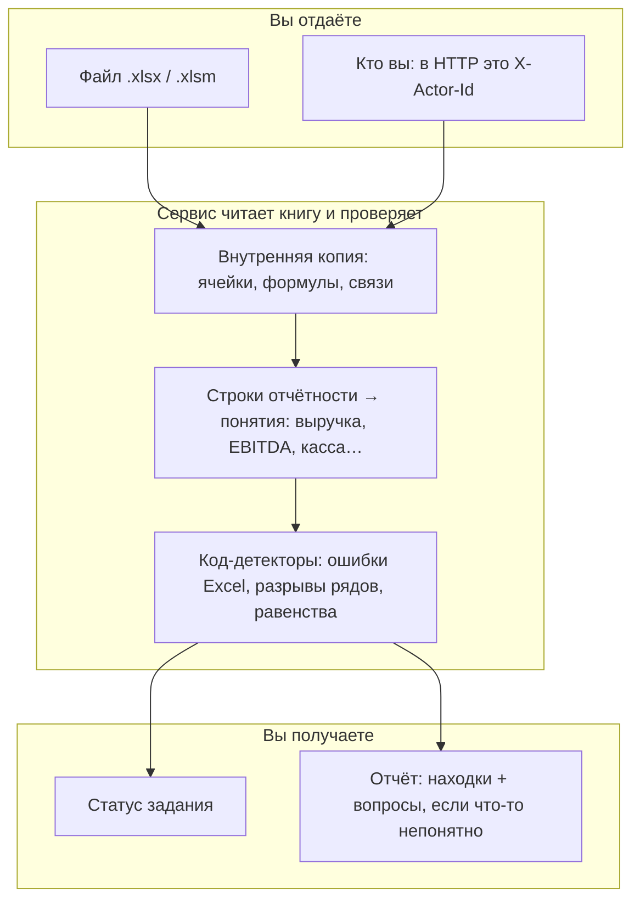

# Как работает cashflow-audit

Документ для человека, который видит сервис впервые: аналитик, заказчик, новый разработчик. Здесь нет порогов cosine и ключей Redis — только смысл. Спецификации для инженеров: [архитектура](architecture/plan.md) и [HTTP API](architecture/api.md).

---

## За минуту

У вас есть Excel-модель денежных потоков: P&L, баланс, ОДДС, долг, предпосылки. Формулы сложные, листов много, глаз перестаёт ловить ошибки.

**cashflow-audit** принимает файл `.xlsx` / `.xlsm` и возвращает JSON-отчёт: что не сходится, в каких ячейках это видно, на какие статьи влияет, что проверить. **Сам файл не меняется** — сервис только читает.

Проверки делает **код** (граф формул, оси периодов, равенства баланса и кассы). Языковая модель **не открывает Excel и не ищет ошибки**. Она может подписать строку («это выручка или GMV?») и переписать текст карточки человеческим языком. Если модели нет, отчёт всё равно будет: карточки по шаблону.

---

## Кому это нужно

| Роль | Что получает |
|---|---|
| Аналитик / аудитор модели | Список проверяемых находок со ссылкой на ячейку, без правок файла |
| Команда, которая принимает модели от клиентов | Один и тот же пайплайн по HTTP: загрузил файл — опросил статус — скачал отчёт |
| Разработчик сервиса | Тот же прогон из CLI, без Redis |

Если модель ещё собирают (нет формул, нет кэша значений Excel) — сервису почти не на что опереться: он не пересчитывает книгу, а читает уже посчитанные ячейки.

---

## Чего сервис не делает

Это важно, иначе ожидания разъедутся с отчётом.

- **Не правит Excel**, не пересчитывает формулы, не запускает макросы VBA/XLM.
- **Не является «ИИ, который понял всю модель»**. Поиск ошибок — детекторы. Модель языка видит лейблы строк и шаблоны формул, не числа из ячеек.
- **Не гарантирует полноту** по таблице требований. Сейчас закрыты технические поломки Excel и равенства: баланс, касса, нераспределённая прибыль, валовая прибыль, EBIT, косвенный CFO, график долга, проценты vs ставка, налог vs ставка. Двойной учёт OPEX в двух SUM, сценарии — в бэклоге, см. [требования](требования.md).
- **Не считает, что хардкод всегда ошибка.** История, договор, крайний прогнозный период могут быть законными. Такие случаи помечаются мягче (`warning`), а не как поломка.
- **Не принимает** `.xls`, `.xlsb`, пароль, ссылку на другую книгу в сети.

---

## Картинка целиком



Снаружи два объекта: **статус** («ещё считает» / «готово» / «нужен ваш ответ») и **отчёт**. Промежуточные таблицы (parquet, mapping) по HTTP не отдаются.

---

## Путь файла: восемь шагов

Один прогон всегда идёт **по порядку**. Стадию, для которой результат уже лежит на диске, сервис **пропускает** (повтор того же файла тем же человеком не гоняет LLM заново).

### 1. Приём

HTTP: заголовок `X-Actor-Id` + файл. Без заголовка — отказ, не «гость». CLI подставляет актора `anonymous`.

Идентификатор аудита считается из **кто вы + байты файла**. Тот же человек и тот же файл → тот же id и тот же отчёт. Другой человек с копией файла → другой аудит, сосед чужой отчёт не увидит.

### 2. Разбор книги (parse)

Zip Excel разбирается как OOXML. Макросы не исполняются, только помечаются. Если книга зашифрована или похожа на zip-бомбу — прогон `failed`.

На этом шаге сервис ещё не «понимает» финансы: он выписывает ячейки, формулы и **кэш значения**, который Excel уже посчитал (`v` в файле).

### 3. Компиляция формул (compile)

Каждая формула становится деревом и списком связей «эта ячейка ссылается на те». Из связей собирается граф. Огромные диапазоны вроде целого столбца обрезаются (лимит 2000 ячеек на ребро), чтобы не взорвать память.

Дальше сырую строку формулы заново не парсят.

### 4. Раскладка листа (layout)

Сервис ищет блоки: колонка названий статей слева, ось времени сверху (`2023`, `2024E`, `1 кв. 2025`). Колонка может быть фактом, прогнозом или сценарием (Base / Upside). Имя листа («P&L») — слабый признак: смотрят заголовки и геометрию.

### 5. Ряды формул (series)

В однотипном ряду (выручка по годам) большинство ячеек должны иметь одну и ту же «формулу-шаблон». Если в одном году вдруг число вместо формулы или ссылка на другой лист — это кандидат на ручную правку. Если ряд слишком пёстрый (нет большинства 70%), сервис **молчит**, а не гадает.

### 6. Имена статей (mapping)

Строка «Выручка» должна стать понятием вроде `pnl.revenue`. Словарь аналитика (glossary) важнее догадки. Потом — похожесть лейбла к [онтологии](../src/cashflow_audit/ontology/taxonomy.yaml). Если неясно — **вопрос вам**, а не молчаливая ошибка. GMV нарочно не считается выручкой.

Без этой карты финансовые равенства не на чем считать: сервис не знает, какая строка — итог активов.

### 7. Проверки (check)

Код выставляет **кандидатов**: ещё не красивый текст, а структура «детектор + ячейки + серьёзность». Примеры:

| Детектор | Простыми словами |
|---|---|
| Ошибка Excel | В ячейке `#REF!`, `#DIV/0!` и т.п. |
| Маскировка | `ЕСЛИОШИБКА` прячет поломку |
| Цикл | Формула ссылается на себя (проценты ↔ долг может быть намеренно) |
| Разрыв ряда | В одном периоде другая формула или константа |
| Дыра в СУММ | Итог не включает новую строку блока |
| Скрытый вход | Скрытая ячейка входит в видимый итог |
| Висячая ячейка | Значение ни на что не влияет |
| Баланс (I1) | Активы ≠ капитал + обязательства, по каждому сломанному периоду |
| Касса (I3a) | Остаток не сходится с **чистым** потоком (не один CFO) |
| Нераспр. прибыль (I3b) | Начало + прибыль − дивиденды ≠ конец |
| Валовая прибыль (I5) | GP ≠ выручка − COGS |
| EBIT (I7) | EBIT ≠ EBITDA − D&A |
| CFO (I9) | NI + D&A − ΔAR − Δзапасы + ΔКЗ ≠ CFO |
| Долг (I10) | Начало + выборка − погашение ≠ конец |
| Проценты (I11) | Проценты ≠ ставка × средний долг |
| Налог (I12) | Налог ≠ ставка × прибыль до налога |

Два независимых блока (например Base и Upside) **не склеиваются** в одну проверку баланса. Колонки сценария и «итого» в эти равенства не входят.

### 8. Financial Risk Screen, след и карточка

После равенств код собирает матрицу F01–F14 (касса, долг, дивиденды, runway…). Это **итог** в `GET /report`, не список всех Excel-ошибок. Затем след по графу и карточки.

### 8b. След и карточка (lineage + explain)

От найденной ячейки сервис идёт по графу **к итоговым показателям** и пишет, на что это влияет. Текст карточки сначала шаблонный. Если есть LLM и есть что объяснять — модель пишет заголовок, доказательство и рекомендацию, **не выдумывая новые ячейки и цифры**. Находка без ссылки на ячейку из разобранной книги в отчёт не попадает.

---

## Что такое находка

Каждая строка отчёта должна быть **проверяемой**: можно открыть Excel на указанных адресах и согласиться или нет.

| Поле | Зачем |
|---|---|
| `cell_refs` | Лист и адрес, часто несколько (левая и правая часть равенства) |
| `severity` | `error` — нарушение формулы или равенства; `warning` — подозрительно, но может быть нормой; `risk` — сигнал, даже если техника сходится |
| `title` / `evidence` | Что случилось и с чем сравнивали |
| `affected_metrics` | Какие статьи онтологии задеты (`pnl.ebitda`, `bs.cash`…) |
| `impact` | Число, если его посчитал identity; иначе направление |
| `recommendation` | Что посмотреть аналитику. Всегда: файл не изменён |
| `tags` | Например крайний период прогноза, «похоже на намеренный цикл» |

Связанные находки (`related_ids`) — общий «хвост» влияния, не отдельная магия.

---

## Статусы прогона

Один статус, не набор галочек. Приоритет: поломка важнее вопроса, вопрос важнее «модель не ответила».

| Статус | Когда | Есть отчёт? |
|---|---|---|
| `queued` | В очереди | нет |
| `running` | Пайплайн идёт | нет |
| `succeeded` | Посчитано, вопросов нет; LLM отработал **или не был нужен** | да |
| `needs_input` | В отчёте есть `questions` | да |
| `degraded` | Вопросов нет, но LLM должен был подписать находки и не ответил | да |
| `failed` | Файл не разобрали (шифрование, zip, внутренний сбой) | нет |

`GET /report` без файла — `409 report_not_ready`. Чужой `X-Actor-Id` — `403`.

---

## Когда сервис спрашивает вас (HITL)

Если строку не удалось однозначно отнести к понятию (или не хватает куска для равенства), в отчёте появляется `questions`: формулировка, ячейка, варианты (`pnl.revenue`, `unknown`…).

Вы отвечаете `POST /v1/audits/{id}/answers`. Сервис:

1. Дописывает ваш словарь (glossary) **только для вас**, не общий на всех.
2. Стирает хвост с mapping до отчёта. Разобранную книгу (parse/compile) **не пересчитывает**.
3. Ставит аудит в очередь снова. Готовые стадии пропускаются, работа начинается с маппинга.

Владелец аудита при этом не меняется.

---

## Как запустить

Нужны Python 3.12+ и [uv](https://docs.astral.sh/uv/). Redis для CLI **не нужен**.

```bash
uv sync
cp .env.example .env          # URL моделей по желанию; пути chat/embed — LLM_CHAT_PATH / EMBEDDING_PATH; HTTPS со своим CA — LLM_TLS_CA_FILE / EMBEDDING_TLS_CA_FILE
uv run cashflow-audit audit ./model.xlsx -o ./report.json
```

Отчёт — в `-o`. Служебные файлы прогона — `data/audits/{audit_id}/`. Повтор той же книги пропускает готовые стадии.

HTTP (нужен Redis):

```bash
uv run cashflow-audit serve --host 127.0.0.1 --port 8080
```

Дальше: `POST /v1/audits` с файлом и заголовком `X-Actor-Id` → опрос `GET /v1/audits/{id}` раз в 1–2 с → `GET .../report` (итог FRS). Техника и равенства — `GET .../integrity`. Карта периодов — `.../layout`. Подробные тела и коды — [api.md](architecture/api.md). Скрипт всех маршрутов: [`scripts/probe/README.md`](../scripts/probe/README.md).

Docker: в образе нет весов моделей. Redis — соседний контейнер, LLM и эмбеддинги — с хоста. См. корневой [README](../README.md).

---

## Как читать отчёт

Откройте JSON. Смотрите в таком порядке:

1. **`status`** — можно ли доверять прогону (`failed` / `needs_input` / `degraded` / `succeeded`).
2. **`summary.headline`** — одна фраза по уже найденным карточкам. Это не приговор «модель верна»: покрытие проверок неполное.
3. **`risk_screen`** — матрица F01–F14 и вердикт. `ready_for_credit` бывает только `false` или отсутствует.
4. **`conclusions`** — сводка: сначала недостоверные метрики (`trust`), затем склейка «техника + риск» (`combo`), затем сигналы динамики. Карточки Excel/identity — в `/integrity`, не копируются сюда целиком.
5. **`questions`** — без ответа маппинг (и равенства, которые от него зависят) неполны.
6. **`llm_used` / `embeddings_used`** — вызывалась ли сеть. `false` при шаблонных карточках — норма, если модели не настраивали или находок не было. Выводы пишет код, не языковая модель.

Поле `sha256` — хеш **содержимого файла**, не `audit_id`. Рекомендация никогда не должна предлагать «исправить ячейку в файле» — сервис этого не делает.

---

## Что проверяется сейчас

**Техника Excel:** ошибки ячеек, циклы, внешние ссылки, VBA/XLM как флаг, разрыв формулы по периодам, константа в формуле, замена формулы числом, неполный `СУММ`, скрытые входы, неиспользуемые ячейки.

**Финансовые равенства (нужен удачный mapping):**

- I1 — баланс по каждому сломанному периоду, отдельно по блоку модели.
- I3a — касса и **net** денежный поток (не один CFO; иначе capex даёт ложный разрыв). При необходимости с разных листов.
- I3b — нераспределённая прибыль, дивиденды если строка найдена.
- I5 — валовая прибыль ≈ выручка − COGS.
- I7 — EBIT ≈ EBITDA − D&A.
- I9 — косвенный CFO: прибыль + D&A ± оборотный капитал.
- I10 — график долга: начало + выборка − погашение = конец.
- I11 — проценты ≈ ставка × средний долг за период.
- I12 — налог ≈ ставка × (NI + налог); ставка 25% при эффективных 14% — error.

**Итог (Financial Risk Screen, `GET /report`):** закрытая матрица F01–F14. Нет статьи → «не применимо», не вопрос HITL. FCF: строка `cf.fcf` или выручка из CFO+CAPEX. DSCR только если строка есть в модели. `/integrity` — техника и равенства, не свалка в отчёт.

**Ещё нет:** двойной учёт в двух SUM, сценарии, точка безубыточности, NPV/IRR, ковенанты пользователя.

Ложные срабатывания, которые требования просят не поднимать до ошибки: хардкод на факте, цикл процентов/налога, отличие формулы в первом/последнем прогнозном году. Их сервис старается пометить тегами и снизить серьёзность.

---

## Словарь

| Слово | Смысл здесь |
|---|---|
| Книга / модель | Ваш `.xlsx` / `.xlsm` |
| IR | Внутреннее представление ячеек и формул после parse/compile |
| Кандидат | Сырая находка без прозы |
| Finding / карточка | То, что попадает в отчёт |
| Онтология | Список понятий (`pnl.revenue`, `bs.cash`…) в `taxonomy.yaml` |
| Glossary | Ваши ответы «эта строка = это понятие» |
| HITL | Человек отвечает на `questions`, прогон маппинга повторяется |
| Актор | Кто загрузил файл; в HTTP — `X-Actor-Id` |
| Skip | Стадия не считается, если её файл уже есть |

---

## Частые вопросы

**Почему в отчёте мало про EBITDA, хотя в Excel она есть?**  
Строка должна быть распознана как `pnl.ebitda` (и `pnl.da` / `pnl.ebit` для I7). Если лейбл странный — будет вопрос, а не равенство.

**Почему статус `degraded`, хотя находки есть?**  
Языковая модель была нужна для текста карточек и не ответила (нет слота GPU, сеть, бюджет). Кандидаты кода на месте, формулировки шаблонные.

**Почему `succeeded`, хотя LLM настроен, а находок нет?**  
Подписывать было нечего — это успех, не деградация.

**Можно ли заставить пересчитать с середины?**  
Нет отдельного `force`. Удалите артефакт стадии (или ответьте на questions — хвост сотрётся сам).

**Куда деваются старые аудиты?**  
Каталоги старше TTL (по умолчанию 14 дней) удаляются, кроме заданий, которые ещё `queued` или `running`.

---

## Куда идти дальше

| Документ | Для кого |
|---|---|
| [Требования](требования.md) | Какие ошибки вообще хотим ловить |
| [HTTP API](architecture/api.md) | Запросы, коды, пример `report.json` |
| [Архитектура](architecture/plan.md) | Стадии, Redis, DuckDB, слоты, инварианты |
| [Правила разработки](../AGENTS.md) | Как менять код, не ломая доверие к отчёту |
| Корневой [README](../README.md) | Быстрый старт CLI / HTTP / Docker |
